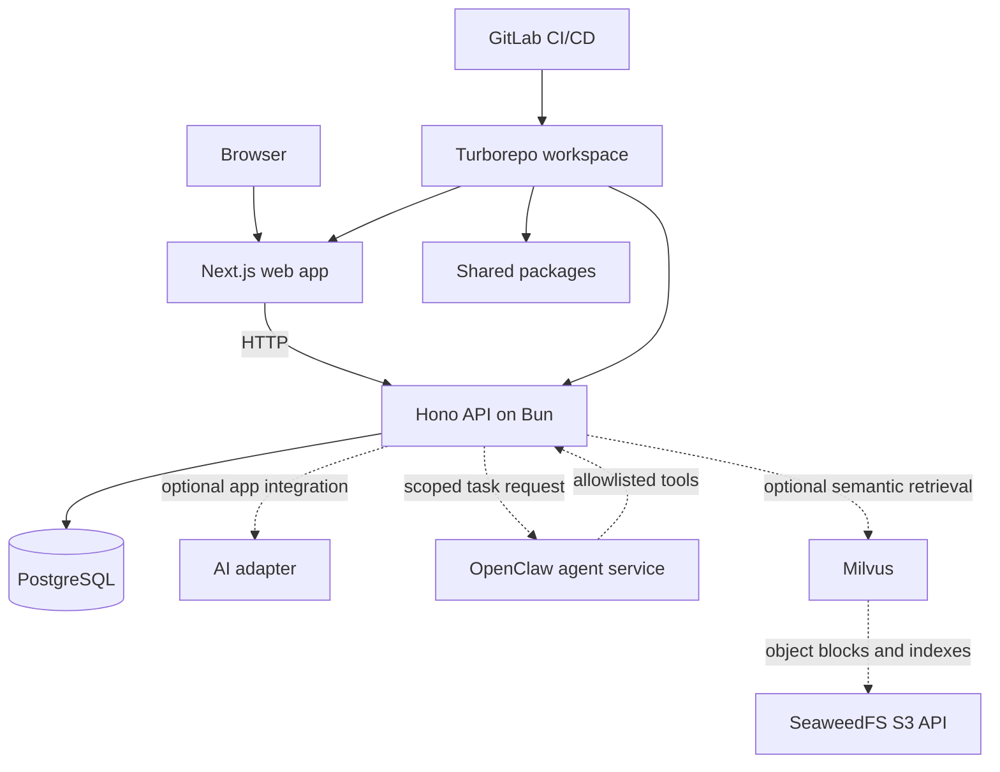

# PHANTOMS architecture

PHANTOMS is a set of explicit application boundaries. The letters name the core choices; they do not require every service to run in every app.

## Core letters

| Letter | Default boundary | Guidance |
| --- | --- | --- |
| **P — PostgreSQL** | `packages/db` owns connection setup, schema, and migrations. | Use relational tables for durable application records. Keep migrations reviewable and test upgrades against disposable data. |
| **H — Hono** | `apps/api` owns HTTP routes and request validation. | Run with Bun. Keep business and persistence code out of route handlers as the app grows. |
| **A — AI** | `packages/ai` owns model access behind an adapter. | Keep credentials on the server, use time and token budgets, validate structured outputs, and isolate provider-specific details. |
| **N — Next.js** | `apps/web` owns the browser experience. | The starter builds a static App Router site so the deployed app needs no additional JavaScript server runtime. Add server rendering only after its Bun runtime path is independently proven for the chosen hosting setup. |
| **T — Turborepo** | Root scripts define the task graph. | Workspaces and `bun.lock` make installs repeatable. CI runs the same commands as local development. |
| **O — OpenClaw** | A separate, optional agent service. | Treat model output and fetched content as untrusted. Keep tools deny-by-default and agent workspaces isolated. |
| **M — Milvus** | An optional retrieval service. | Add when vector or hybrid search has a measured need. Benchmark indexing, query quality, memory, and backup/restore before production. |
| **S — SeaweedFS** | Optional S3-compatible object storage. | Add for binary data or Milvus object storage after verifying the exact client/backend semantics and recovery process. |

## Core versus optional services

The runnable starter includes PostgreSQL, a Hono API, a static Next.js site, and an AI adapter package. This makes the first local run light enough for learning while showing the seams where the other PHANTOMS pieces fit.

| Layer | Add when | Example additions |
| --- | --- | --- |
| Identity | A route serves more than the local developer. | OIDC provider such as Keycloak; API authorization and tenant checks remain application responsibilities. |
| Cache / queue | Measured latency, background work, or coordination requires it. | Redis or another managed queue/cache. Define expiry, retry, and idempotency behavior. |
| User search | Relational filtering is no longer the right search experience. | Meilisearch; define index synchronization and deletion behavior. |
| Retrieval | Semantic/hybrid search improves a tested workflow. | Milvus, embeddings, and an object store such as SeaweedFS. Track source IDs, authorization, freshness, and deletion through every index. |
| Agents | A product has bounded work that benefits from tools or multi-step orchestration. | OpenClaw behind an authenticated internal interface with per-agent tools, resource limits, audit records, and a human approval step for consequential actions. |
| Observability | The app has an operational target and can act on telemetry. | Metrics, structured logs, traces, alerts, and dashboards. Avoid sending secrets or personal content in telemetry. |

Do not adopt every optional service just because it appears in the acronym. Every stateful service adds security, cost, capacity, backup, upgrade, and recovery work.

## Request and data flow

1. A browser loads the Next.js static output from a web host or reverse proxy.
2. The browser calls Hono through a same-origin proxy or an explicitly configured API origin.
3. Hono authenticates and authorizes the caller before application operations. The local sample binds to loopback and is intentionally not an internet-ready API.
4. Hono validates inputs, uses PostgreSQL for durable records, and calls the AI adapter only on server-side code paths.
5. Optional agents, retrieval, and object storage stay behind internal service boundaries and receive only the minimum data needed for a task.

The sample currently demonstrates API validation, database storage, health/readiness separation, and the AI provider boundary package. It does not wire a model call into an unauthenticated route. It also does not implement production identity, tenant authorization, a deployed agent, embeddings, object-storage policies, or a production backup service.

## Deployment shape

- Serve the static Next export from a controlled web host or reverse proxy, or use the provided `Dockerfile` to serve it from Hono in the same Bun container.
- Run the Hono service in a Bun image behind a TLS-terminating ingress.
- Keep PostgreSQL and optional stateful services on private networks with authentication, encryption, backup, restore tests, and capacity alerts.
- Route browser API calls through the same origin when possible; otherwise use a narrow explicit CORS allowlist.
- Keep model and service credentials in the deployment's secret manager. Never put them in the image, repository, query string, or browser bundle.
- Deploy immutable image digests only after build, scan, test, SBOM, and provenance gates pass.

See [CI/CD](ci-cd.md) and [Security](security.md) for the operating contract.

For the complete supporting tool set from the original PHANTOMS proposal, see [Recommended supporting tools](recommended-tooling.md).
